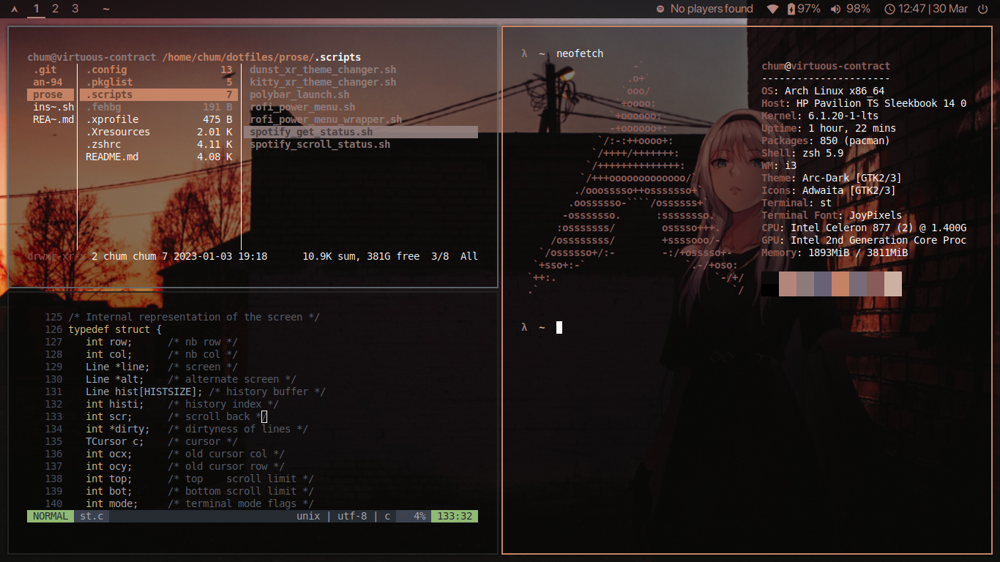
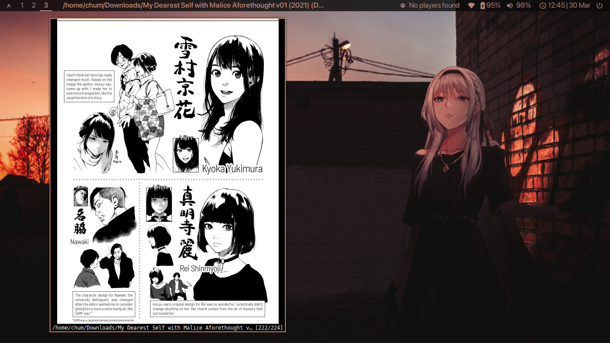

# `an-94`
> as a result of its complexity, the AN-94 is incredibly user unfriendly when it comes to maintenance, and thus became unfit to replace the AK-47

## Screenshots

## Details
+ distro: [`Arch Linux`](https://www.archlinux.org/)
+ display server: [`X`](https://www.x.org/wiki/)
+ wallpaper: [here](https://github.com/notchum/wallpapers/blob/main/anime/anime-irl-an-94-1600x1066.jpg)
+ fonts: `Cascadia Code` and `San Francisco Pro`
+ icons: `Adwaita`
+ shown in the screenshots: `i3`, `polybar`, `neovim`, `zathura`, `ranger`, `st`.

### CLI
- [zsh](https://github.com/zsh-users/zsh) - A shell designed for interactive use, although it is also a powerful scripting language.
    - [lambda-minimal Theme](https://github.com/sohnryang/lambda-minimal-theme)
    - [ohmyzsh](https://github.com/ohmyzsh/ohmyzsh) - An open source, community-driven framework for managing your zsh configuration.
        - [z](https://github.com/rupa/z) - Tracks your most used directories, based on frequency.
        - [zsh-syntax-highlighting](https://github.com/zsh-users/zsh-syntax-highlighting) - Fish shell like syntax highlighting for zsh.
        - [zsh-autosuggestions](https://github.com/zsh-users/zsh-autosuggestions) - Fish-like autosuggestions for zsh.
- [neovim](https://github.com/neovim/neovim) - Hyperextensible Vim-based text editor.
    - [vim-plug](https://github.com/junegunn/vim-plug) - Minimalist Vim plugin manager.
    - [pynvim](https://github.com/neovim/pynvim) - Python client and plugin host for Nvim.
- [kitty](https://sw.kovidgoyal.net/kitty/) - A fast, featureful, GPU based terminal emulator.
- [st](https://github.com/notchum/st) - My fork of the suckless simple terminal (st).

### Tools
- [bat](https://github.com/sharkdp/bat) - A cat clone with syntax highlighting and Git integration.
- [delta](https://github.com/dandavison/delta) - A syntax-highlighting pager for git, diff, and grep output.
- [dust](https://github.com/bootandy/dust) - A more intuitive version of du in rust.
- [fzf](https://github.com/junegunn/fzf) - A command-line fuzzy finder.
- [gotop](https://github.com/xxxserxxx/gotop) - A terminal based graphical activity monitor.
- [neofetch](https://github.com/dylanaraps/neofetch) - A command-line system information tool written in bash.
- [onefetch](https://github.com/o2sh/onefetch) - A command-line Git information tool.

### Display
- [dunst](https://github.com/dunst-project/dunst) - Lightweight and customizable notification daemon.
- [i3](https://github.com/i3/i3) - A tiling window manager.
- [i3blocks](https://github.com/vivien/i3blocks) - A feed generator for text based status bars.
- [ly](https://github.com/fairyglade/ly) - A lightweight TUI (ncurses-like) display manager for Linux and BSD.
- [paru](https://github.com/Morganamilo/paru) - Feature packed AUR helper.
- [picom](https://github.com/yshui/picom) - A lightweight compositor for X11.
- [polybar](https://github.com/polybar/polybar) - A fast and easy-to-use status bar.
    - [polybar-spotify](https://github.com/PrayagS/polybar-spotify) - Spotify status and controls module for Polybar with text scrolling.
- [rofi](https://github.com/davatorium/rofi) - A window switcher, application launcher and dmenu replacement.

### Applications
- [feh](https://feh.finalrewind.org/) - An X11 image viewer aimed mostly at console users.
- [firefox](https://mozilla.org/firefox) - A free and open source web browser.
- [flameshot](https://github.com/flameshot-org/flameshot) - A powerful yet simple to use screenshot software.
- [mpv](https://github.com/mpv-player/mpv) - A free (as in freedom) media player for the command line.
- [pcmanfm](https://archlinux.org/packages/community/x86_64/pcmanfm/) - Extremely fast and lightweight file manager.
    - [ark](https://apps.kde.org/ark/) - A graphical file compression/decompression utility that can be used to browse, extract, create, and modify archives.
- [ranger](https://github.com/ranger/ranger) - A VIM-inspired filemanager for the console.
- [spotify-tui](https://github.com/Rigellute/spotify-tui) - A Spotify client for the terminal written in Rust.
    - [spotifyd](https://github.com/Spotifyd/spotifyd) - A Spotify daemon.
- [zathura](https://github.com/pwmt/zathura) - A document viewer.
