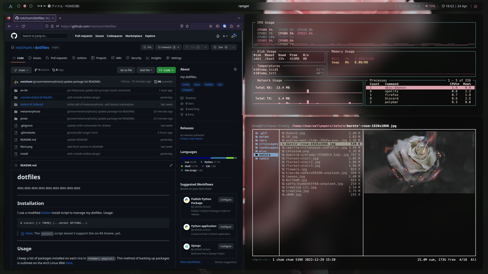
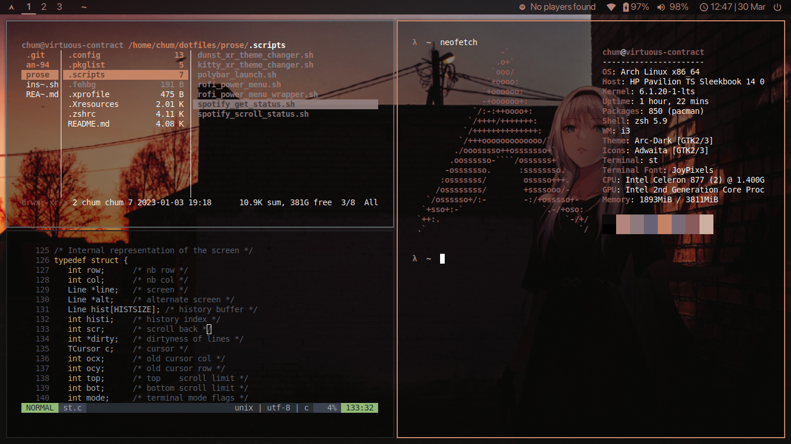

# dotfiles

My collection of dotfiles from over the years. This repo is mostly used as a reference for snapshots of past configurations that I had on old systems and isn't really intended to be easily deployed on anyone's system using the provided `install` script - for something like that I'd suggest looking at [hyprdots](https://github.com/prasanthrangan/hyprdots).

That being said, dotfiles that should be compatible with any system are kept in [`home`](home/) and [`config`](config/). Any extra configurations are kept in [`rices`](rices/) in the respective rice's folder. These are usually configurations with certain themes or for certain niche applications.

I've named each rice to better identify each 'theme'. Since each rice is more of a snapshot in time rather than a reflection of my current config, there will be some things that are out-of-date, deprecated, and/or something that I no longer use. In order from newest to oldest:
| name                                    | description                                       | status     |
|-----------------------------------------|---------------------------------------------------|------------|
| [`grimoire`](rices/grimoire/)           | **my current config** - black, dark, kde          | maintained |
| [`metamorphosis`](rices/metamorphosis/) | my favorite rice - soothing, lightweight, sway    | archived   |
| [`prose`](rices/prose/)                 | my first desktop rice - pretty, well-rounded, i3  | archived   |
| [`an-94`](rices/an-94/)                 | my first laptop rice - simple, transparent, i3    | archived   |

## Installation

I use a modified [dotbot](https://github.com/anishathalye/dotbot) install script to manage my dotfiles. Usage:
```sh
$ install [--rice an-94|grimoire|metamorphosis|prose] (...dotbot OPTIONS...)
```

Just running `./install` is enough to link all dotfiles from [`home`](home/) and [`config`](config/). But using the `--rice` option will link the files within the respective rice's folder.

> [!NOTE]
> The `install` script doesn't install packages, those would have to be installed manually. See [`packages`](packages/).

## Usage

~~I keep a list of packages installed on each rice in `<theme>/.pkglist/`. This method of backing up packages is outlined on the Arch Linux Wiki [here](https://wiki.archlinux.org/title/Pacman/Tips_and_tricks#List_of_installed_packages).~~ I used to run a cronjob that used `pacman` to backup all of the packages currently installed to a `.pkglist/` directory. However, I now just manually keep lists of various packages that I use in [`packages`](packages/).

The wallpapers can be found here: [wallpapers](https://github.com/notchum/wallpapers).

## Screenshots

### [`metamorphosis`](rices/metamorphosis/)


### [`prose`](rices/prose/)




### [`an-94`](rices/an-94/)




## Fetches

- [pfetch](https://github.com/dylanaraps/pfetch) - Fast and pretty fetch tool that can be configured with one line in `.zshrc`/`.bashrc`.
- [nitch](https://github.com/ssleert/nitch) - Very uniquely designed fetch tool that has a great configuration out of the box.
- [macchina](https://github.com/Macchina-CLI/macchina) - Extremely customizable fetch tool with an amazing name. Also written in Rust btw.
- [neofetch](https://github.com/dylanaraps/neofetch) - The king of system info. Holds a special place in my heart.


