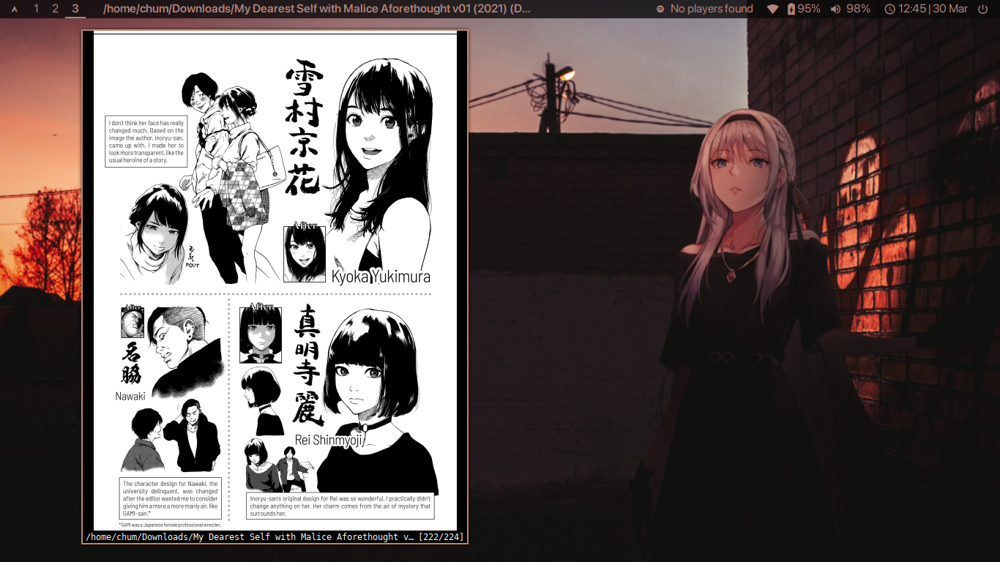

# dotfiles

Here are my dotfiles (my rice repo)!

---

## Installation
> **Note**: **The `install.sh` script is still a WIP.** I would recommend manually copying files for now.

```sh
git clone https://github.com/notchum/dotfiles.git
cd dotfiles
chmod +x install.sh
./install.sh
```
---

## Usage

I keep a list of packages installed on each rice in `<theme>/.pkglist/`. The README in that directory describes how those files are updated and how to install packages from the list. This method of backing up packages is outlined on the Arch Linux Wiki [here](https://wiki.archlinux.org/title/Pacman/Tips_and_tricks#List_of_installed_packages).

The wallpapers can be found here: [wallpapers](https://github.com/notchum/wallpapers).

---

##  Screenshots

### [`prose`](prose/)


### [`an-94`](an-94/)



