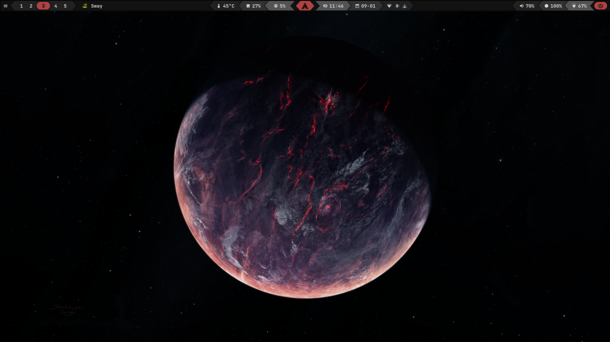
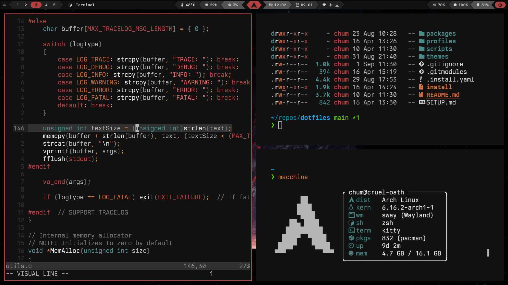
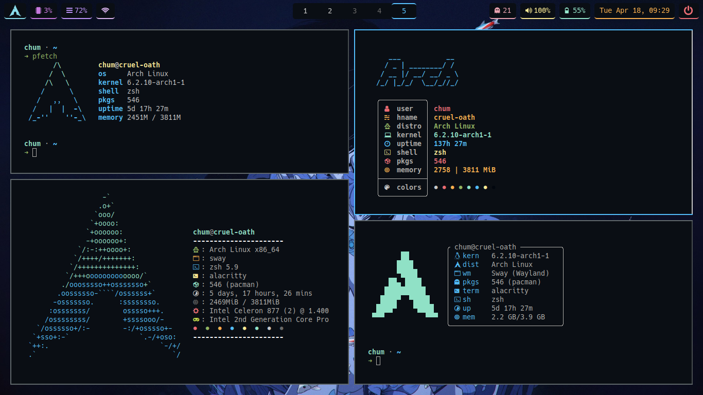

# dotfiles

- distro: `arch linux`
- window manager: `sway`
- bar: `waybar`
- launcher: `fuzzel`
- terminal emulator: `kitty`
- text editor: `neovim`
- file manager: `yazi`

## Installation

I use a modified [dotbot](https://github.com/anishathalye/dotbot) install script to manage my dotfiles. Usage:
```sh
$ install [--theme ashen|ayu-dark|gruvbox-dark] (...dotbot OPTIONS...)
```

Just running `./install` is enough to link all dotfiles from [`home`](home/) and [`config`](config/). But using the `--theme` option will link the files from the respective theme folder. Most applications' configuration files expect one of the available themes to be set.

> [!NOTE]
> The `install` script doesn't install packages, those would have to be installed manually. See [`packages`](packages/).

## Usage

~~I keep a list of packages installed on each rice in `<theme>/.pkglist/`. This method of backing up packages is outlined on the Arch Linux Wiki [here](https://wiki.archlinux.org/title/Pacman/Tips_and_tricks#List_of_installed_packages).~~ I used to run a cronjob that used `pacman` to backup all of the packages currently installed to a `.pkglist/` directory. However, I now just manually keep lists of various packages that I use in [`packages`](packages/).

The wallpapers can be found here: [wallpapers](https://github.com/notchum/wallpapers). This repo is cloned to `~/Pictures` with the dotbot install script.

Using a dotbot plugin, I am able to identify my different machines by host name and link different configuration files for each. That is, I am able to use this single repo and single install script to bootstrap my dotfiles for both my KDE Plasma workstation and my sway laptop.

## Screenshots

### [`ashen`](https://github.com/ficd0/ashen)




## Fetches

- [pfetch](https://github.com/dylanaraps/pfetch) - Fast and pretty fetch tool that can be configured with one line in `.zshrc`/`.bashrc`.
- [nitch](https://github.com/ssleert/nitch) - Very uniquely designed fetch tool that has a great configuration out of the box.
- [macchina](https://github.com/Macchina-CLI/macchina) - Extremely customizable fetch tool with an amazing name. Also written in Rust btw.
- [neofetch](https://github.com/dylanaraps/neofetch) - The king of system info. Holds a special place in my heart.


