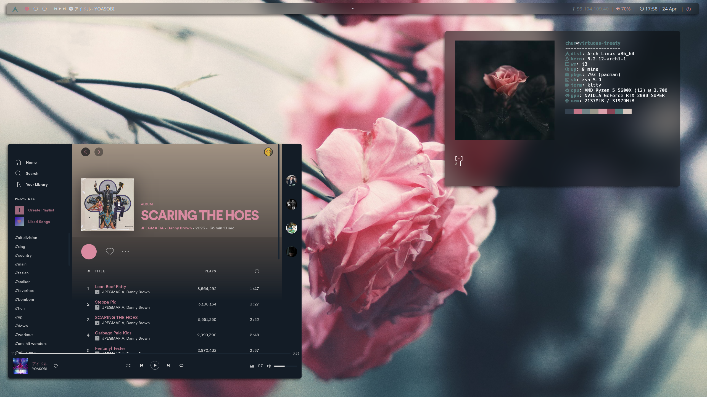

# dotfiles

dots dots dots dots dots dots dots dots dots

---

## Installation

I use a modified [dotbot](https://github.com/anishathalye/dotbot) install script to manage my dotfiles. Usage:
```sh
$ install [-t THEME] (...dotbot OPTIONS...)
```

> **Note**: **The `install` script doesn't support an-94/prose rices, yet.**

---

## Usage

I keep a list of packages installed on each rice in `<theme>/.pkglist/`. The README in that directory describes how those files are updated and how to install packages from the list. This method of backing up packages is outlined on the Arch Linux Wiki [here](https://wiki.archlinux.org/title/Pacman/Tips_and_tricks#List_of_installed_packages).

The wallpapers can be found here: [wallpapers](https://github.com/notchum/wallpapers).

---

## Screenshots

### [`metamorphosis`](metamorphosis/)


### [`prose`](prose/)




### [`an-94`](an-94/)


---

## Fetches

- [pfetch](https://github.com/dylanaraps/pfetch) - Fast and pretty fetch tool that can be configured with one line in `.zshrc`/`.bashrc`.
- [nitch](https://github.com/ssleert/nitch) - Very uniquely designed fetch tool that has a great configuration out of the box.
- [macchina](https://github.com/Macchina-CLI/macchina) - Extremely customizable fetch tool with an amazing name. Also written in Rust btw.
- [neofetch](https://github.com/dylanaraps/neofetch) - The king of system info. Holds a special place in my heart.


