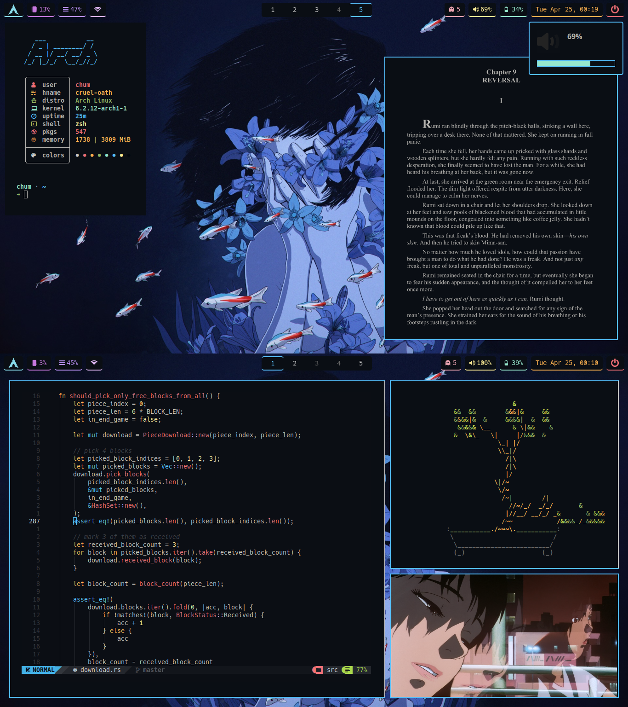

# dotfiles

Here are my dotfiles (my rice repo)!

---

## Installation
> **Note**: **The `install` script for earlier an-94/prose is still a WIP.**

I use a modified [dotbot](https://github.com/anishathalye/dotbot) install script to manage my dotfiles. Usage:
    ```sh
    $ install (an-94|prose|metamorphosis)
    ```
---

## Usage

I keep a list of packages installed on each rice in `<theme>/.pkglist/`. The README in that directory describes how those files are updated and how to install packages from the list. This method of backing up packages is outlined on the Arch Linux Wiki [here](https://wiki.archlinux.org/title/Pacman/Tips_and_tricks#List_of_installed_packages).

The wallpapers can be found here: [wallpapers](https://github.com/notchum/wallpapers).

---

##  Screenshots

### [`metamorphosis`](metamorphosis/)




### [`prose`](prose/)


### [`an-94`](an-94/)


