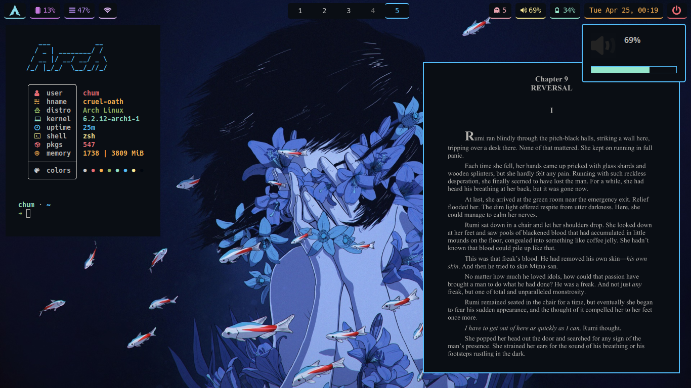
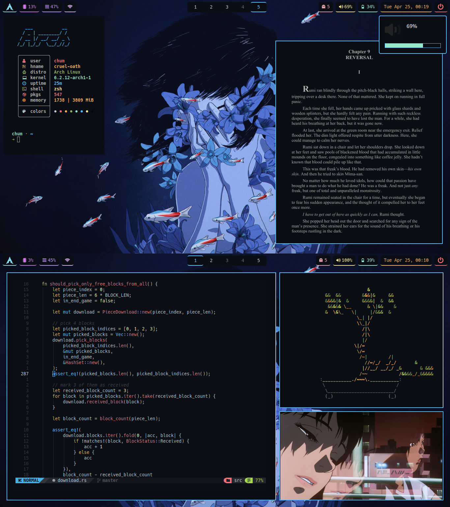

# `metamorphosis`
> illusions can't come to life

## Screenshots

## Details
+ distro: [`Arch Linux`](https://www.archlinux.org/)
+ wm/compositor: [`Wayland`](https://wayland.freedesktop.org/)
+ wallpapers: [one](https://github.com/notchum/wallpapers/blob/main/anime/perfect_blue.jpg)
+ font: `Hack`
+ icons: `Pop`
+ Shown in the screenshots: `sway`, `waybar`, `firefox`, `neovim`, `nitch`, `zathura`, `cbonsai`, `alacritty`.

### CLI
- [zsh](https://github.com/zsh-users/zsh) - A shell designed for interactive use, although it is also a powerful scripting language.
    - [spaceship](https://github.com/spaceship-prompt/spaceship-prompt) - Minimalistic, powerful and extremely customizable zsh prompt.
    - [ohmyzsh](https://github.com/ohmyzsh/ohmyzsh) - An open source, community-driven framework for managing your zsh configuration.
        - [z](https://github.com/rupa/z) - Tracks your most used directories, based on frequency.
        - [zsh-syntax-highlighting](https://github.com/zsh-users/zsh-syntax-highlighting) - Fish shell like syntax highlighting for zsh.
        - [zsh-autosuggestions](https://github.com/zsh-users/zsh-autosuggestions) - Fish-like autosuggestions for zsh.
- [neovim](https://github.com/neovim/neovim) - Hyperextensible Vim-based text editor.
    - [NvChad](https://github.com/NvChad/NvChad) - An attempt to make neovim cli functional like an IDE while being very beautiful, blazing fast startuptime.
- [alacritty](https://github.com/alacritty/alacritty) - A cross-platform, OpenGL terminal emulator.

### Tools
- [bat](https://github.com/sharkdp/bat) - A cat clone with syntax highlighting and Git integration.
- [bash-pipes](https://github.com/pipeseroni/pipes.sh) - Animated pipes terminal screensaver.
- [cbonsai](https://gitlab.com/jallbrit/cbonsai) - Grow bonsai trees in your terminal.
- [delta](https://github.com/dandavison/delta) - A syntax-highlighting pager for git, diff, and grep output.
- [dust](https://github.com/bootandy/dust) - A more intuitive version of du in rust.
- [exa](https://github.com/ogham/exa) - A modern replacement for ‘ls’.
- [fzf](https://github.com/junegunn/fzf) - A command-line fuzzy finder.
- [gotop](https://github.com/xxxserxxx/gotop) - A terminal based graphical activity monitor.
- [lazygit](https://github.com/jesseduffield/lazygit) - Simple terminal UI for git commands.
- [nitch](https://github.com/ssleert/nitch) - Incredibly fast system fetch written in nim.
- [onefetch](https://github.com/o2sh/onefetch) - A command-line Git information tool.
- [paru](https://github.com/Morganamilo/paru) - Feature packed AUR helper.
- [wl-clipboard](https://github.com/bugaevc/wl-clipboard) - Command-line copy/paste utilities for Wayland.
- [yt-dlp](https://github.com/yt-dlp/yt-dlp) - A youtube-dl fork with additional features and fixes.

### Display
- [sway](https://github.com/swaywm/sway) - i3-compatible Wayland compositor.
    - [autotiling](https://github.com/nwg-piotr/autotiling) - Script for sway and i3 to automatically switch the horizontal / vertical window split orientation.
    - [swaybg](https://github.com/swaywm/swaybg) - Wallpaper tool for Wayland compositors.
    - [swayidle](https://github.com/swaywm/swayidle) - Idle management daemon for Wayland.
    - [swaylock-effects](https://github.com/mortie/swaylock-effects) - Swaylock, with fancy effects.
- [dunst](https://github.com/dunst-project/dunst) - Lightweight and customizable notification daemon.
- [greetd](https://git.sr.ht/~kennylevinsen/greetd) - A minimal and flexible login manager daemon that makes no assumptions about what you want to launch.
    - [tuigreet](https://github.com/apognu/tuigreet) - Graphical console greeter for greetd.
- [waybar](https://github.com/Alexays/Waybar) - Highly customizable Wayland bar for Sway and Wlroots based compositors.
    - Modified version of [theCode-Breaker's waybar config](https://github.com/theCode-Breaker/riverwm)
- [rofi-lbonn-wayland](https://github.com/lbonn/rofi) - A window switcher, application launcher and dmenu replacement - fork with wayland support.
    - [adi1090x's rofi menus](https://github.com/adi1090x/rofi) - A huge collection of Rofi based custom Applets, Launchers & Powermenus.

### Applications
- [imv](https://sr.ht/~exec64/imv/) - A command line image viewer intended for use with tiling window managers.
- [firefox](https://mozilla.org/firefox) - A free and open source web browser.
- [grim](https://sr.ht/~emersion/grim/) - Grab images from a Wayland compositor.
    - [slurp](https://github.com/emersion/slurp) - Select a region in a Wayland compositor.
- [mpv](https://github.com/mpv-player/mpv) - A free (as in freedom) media player for the command line.
    - [mpv_thumbnail_script](https://github.com/marzzzello/mpv_thumbnail_script) - Show preview thumbnails in mpv's OSC seekbar.
- [ranger](https://github.com/ranger/ranger) - A VIM-inspired filemanager for the console.
    - [ranger_devicons](https://github.com/alexanderjeurissen/ranger_devicons) - Ranger plugin that adds file glyphs / icon support to Ranger.
- [spotify-tui](https://github.com/Rigellute/spotify-tui) - A Spotify client for the terminal written in Rust.
    - [spotifyd](https://github.com/Spotifyd/spotifyd) - A Spotify daemon. 
- [zathura](https://github.com/pwmt/zathura) - A document viewer.