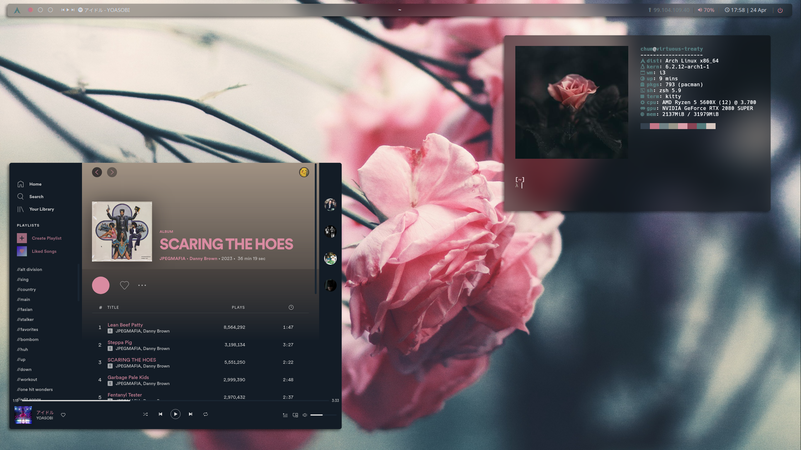
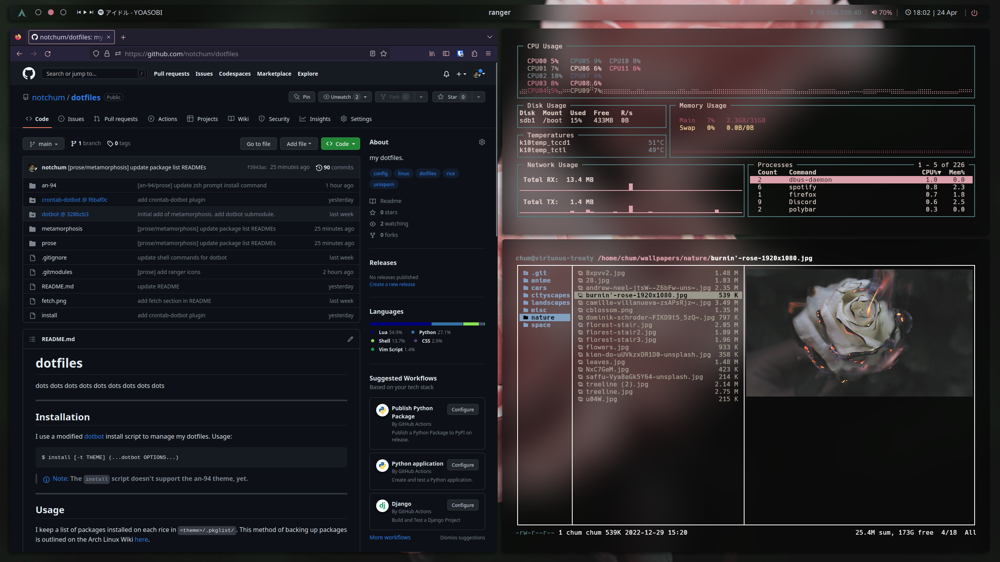

# `prose`
> of course i still love you

## Screenshots

## Details
+ distro: [`Arch Linux`](https://www.archlinux.org/)
+ display server: [`X`](https://www.x.org/wiki/)
+ wallpapers: [one](https://github.com/notchum/wallpapers/blob/main/nature/flowers.jpg)
              [two](https://github.com/notchum/wallpapers/blob/main/nature/u04W.jpg)
              [three](https://github.com/notchum/wallpapers/blob/main/nature/saffu-Vya8eGk5Y64-unsplash.jpg)
+ font: `Hack` and `NotoSans Nerd Font`
+ icons: `Papirus`
+ Shown in the screenshots: `i3`, `polybar`, `firefox`, `spotify`, `neovim`, `gotop`, `ranger`, `zathura`, `kitty`.

### CLI
- [zsh](https://github.com/zsh-users/zsh) - A shell designed for interactive use, although it is also a powerful scripting language.
    - [lambda-minimal](https://github.com/sohnryang/lambda-minimal-theme) - Minimal zsh prompt.
    - [ohmyzsh](https://github.com/ohmyzsh/ohmyzsh) - An open source, community-driven framework for managing your zsh configuration.
        - [z](https://github.com/rupa/z) - Tracks your most used directories, based on frecency.
        - [zsh-syntax-highlighting](https://github.com/zsh-users/zsh-syntax-highlighting) - Fish shell like syntax highlighting for zsh.
        - [zsh-autosuggestions](https://github.com/zsh-users/zsh-autosuggestions) - Fish-like autosuggestions for zsh.
- [neovim](https://github.com/neovim/neovim) - Hyperextensible Vim-based text editor.
    - [vim-plug](https://github.com/junegunn/vim-plug) - Minimalist Vim plugin manager.
- [kitty](https://sw.kovidgoyal.net/kitty/) - A fast, featureful, GPU based terminal emulator.

### Tools
- [bat](https://github.com/sharkdp/bat) - A cat clone with syntax highlighting and Git integration.
- [bash-pipes](https://github.com/pipeseroni/pipes.sh) - Animated pipes terminal screensaver.
- [delta](https://github.com/dandavison/delta) - A syntax-highlighting pager for git, diff, and grep output.
- [dust](https://github.com/bootandy/dust) - A more intuitive version of du in rust.
- [exa](https://github.com/ogham/exa) - A modern replacement for ‘ls’.
- [fzf](https://github.com/junegunn/fzf) - A command-line fuzzy finder.
- [gotop](https://github.com/xxxserxxx/gotop) - A terminal based graphical activity monitor.
- [lazygit](https://github.com/jesseduffield/lazygit) - Simple terminal UI for git commands.
- [neofetch](https://github.com/dylanaraps/neofetch) - A command-line system information tool written in bash.
- [onefetch](https://github.com/o2sh/onefetch) - A command-line Git information tool.
- [paru](https://github.com/Morganamilo/paru) - Feature packed AUR helper.
- [yt-dlp](https://github.com/yt-dlp/yt-dlp) - A youtube-dl fork with additional features and fixes.

### Display
- [i3](https://github.com/i3/i3) - A tiling window manager.
    - [autotiling](https://github.com/nwg-piotr/autotiling) - Script for sway and i3 to automatically switch the horizontal / vertical window split orientation.
    - [i3-resurrect](https://github.com/JonnyHaystack/i3-resurrect) - A solution for saving and restoring i3 workspaces.
- [dunst](https://github.com/dunst-project/dunst) - Lightweight and customizable notification daemon.
- [lightdm](lightdm-webkit-theme-litarvan) - A cross-desktop display manager.
    - [litarvan](https://github.com/Litarvan/lightdm-webkit-theme-litarvan) - LightDM theme.
- [picom](https://github.com/yshui/picom) - A lightweight compositor for X11.
- [polybar](https://github.com/polybar/polybar) - A fast and easy-to-use status bar.
    - [polybar-spotify](https://github.com/PrayagS/polybar-spotify) - Spotify status and controls module for Polybar with text scrolling.
- [rofi](https://github.com/davatorium/rofi) - A window switcher, application launcher and dmenu replacement.

### Applications
- [feh](https://feh.finalrewind.org/) - An X11 image viewer aimed mostly at console users.
- [firefox](https://mozilla.org/firefox) - A free and open source web browser.
- [flameshot](https://github.com/flameshot-org/flameshot) - A powerful yet simple to use screenshot software.
- [mpv](https://github.com/mpv-player/mpv) - A free (as in freedom) media player for the command line.
    - [mpv_thumbnail_script](https://github.com/marzzzello/mpv_thumbnail_script) - Show preview thumbnails in mpv's OSC seekbar.
- [ranger](https://github.com/ranger/ranger) - A VIM-inspired filemanager for the console.
    - [ranger_devicons](https://github.com/alexanderjeurissen/ranger_devicons) - Ranger plugin that adds file glyphs / icon support to Ranger.
- [spicetify](https://github.com/spicetify/spicetify-cli) - Command-line tool to customize Spotify client.
    - [sleek cherry](https://github.com/spicetify/spicetify-themes) - 
- [zathura](https://github.com/pwmt/zathura) - A document viewer.